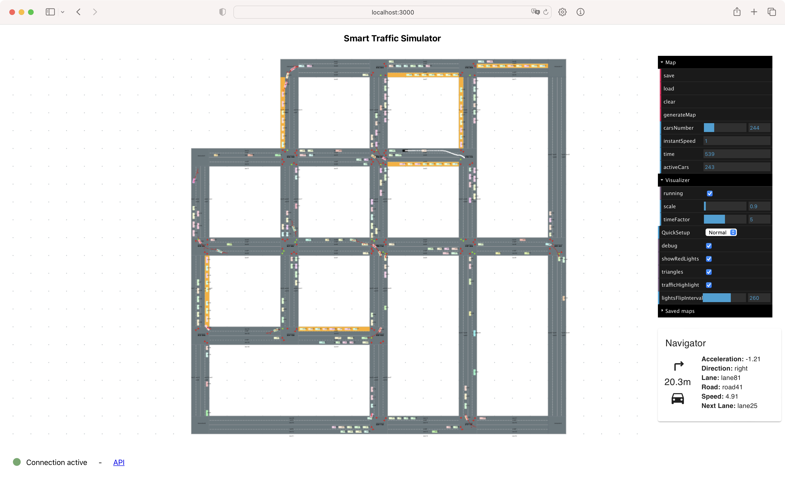
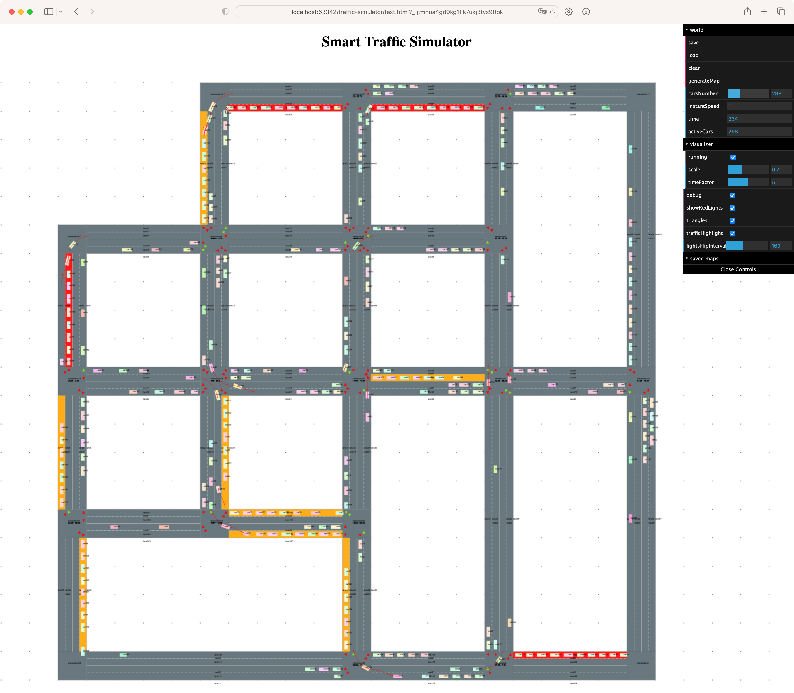

# Traffic simulator

This is a fork of [RoadTrafficSimulator](https://github.com/volkhin/RoadTrafficSimulator)

The main purpose of this project is to simulate traffic on a map and to find the best path for a car to reach its
destination.

<div align="center">
  <p><b>Simulator Preview</b></p>
</div>
<p align="center">
   <br/>
</p>

[//]: # (<div align="center">)

[//]: # (  <p><b>Traffic Highlights</b></p>)

[//]: # (</div>)

[//]: # (<p align="center">)

[//]: # (   <br/>)

[//]: # (</p>)

<div align="center">
  <p><b>Best Path Finder</b></p>
</div>
<p align="center">
   <br/>
</p>

## Online Demo
[Simulator](https://tede12.github.io/traffic-simulator/index.html)

## Commands

- shift + click - add new intersection
- shift + drag - add new road
- ctrl + click (on lanes) - add new car (if track path exists the car will follow it)
- alt (or option) + click (on intersections) - add new point to track path
- alt (or option) + click (everywhere except intersections) - remove last point from track path
- alt (or option) + 's' - save and draw track path (if it exists, else remove it)
- alt (or option) + 'c' - send path to pathFinder, draw path and start car (needs pathFinder server running)
    - repeating the command in different period of time, you will get the best path in the current situation
- alt (or option) + 'g' - ask the shortest path based only on road length to api and draw path (needs pathFinder server
  running)

## How to run

1. Install all dependencies  
   `npm install`

2. Run 2 scripts in parallel  
   `npm run cstart`  
   `npm run start`

For running the pathFinder server, you need to have installed [ITAS-API](https://github.com/sir3mat/ITAS-API)

## How to build

`npm run gh-pages` for building the project and publishing it on github pages  
<br>
For building the **CoffeeScript** backend just run `npm run cbuild` (or `gulp build`)  
For building the **ReactJS** frontend just run `npm run build`

## TODO

- [see 3D model](http://lo-th.github.io/root/traffic/) for inspiration
- [pathfinding](https://github.com/lo-th/Dedal.lab)

### ROADMAP

- [x] Draw car path
- [x] Draw a priori track path
- [x] Choose destination for my car
- [x] Add algorithm for pathfinding
- [x] Enable resize of map when Running checkbox is off and generate only closed maps
- [x] Send map first time to pathFinder, add Unique ID for each map
- [x] NO spawn cars when my car is placed on the road for 5 seconds
- [ ] Add little screen with my car info on the simulator
- [ ] Set new weights and get the current best path when car is moving
    - [x] endpoint on API in order to set new weights or an updated version of the map object
    - [x] get number of cars on each road (don't overcomplicate things with lane based on next intersection)
    - [x] get traffic lights status for each intersection and improve the algorithm with this info
- [x] Socket for checking if pathFinder server is running
- [x] Integrate MQTT with correct request protocol (meeting required)

- [ ] Control my car with arrow keys

### BUGS

- [x] Fix blocked cars (see on .move() method of Car class)
- [x] Check algorithm for car generation and trajectory
- [x] After the pathFinder sends the new path, if there are too many cars on the road, myCar fails to get direction
- [x] It seems that when there are generated maps with roads that pass one through another, the pathFinder fails to find
  the best path,
  with error: dijkstra.c:948 : Couldn't reach some of the requested target vertices. -> This can happen if the graph is
  not strongly connected or if none of the target vertices have outgoing edges.)
  Handled with:
    - [x] IntersectionId must be in increasing order to work correctly with graph library
- [x] Sometimes the map do not spawn cars immediately (after a while they should be spawn, but not always)

- [ ] (Not required) When an intersection is already occupied by some cars, the new car should wait for entering the
  intersection even if it has green light

# TIPS

- drawSegment must be called like this:
   ```coffeescript
   @graphics.drawSegment(myRoad.middleLine)
   @graphics.stroke 'green'
   ```
- `mousedown` event should be bound to `canvas` element, not `window` or `document` otherwise it will stick the map to
  the mouse cursor when you drag it

- **CORS** are all fixed, for running javascript debugger without errors with WebStorm, just follow these steps:
  `Settings -> Build, Execution, Deployment -> Debugger -> Allow unsigned requests` this prevent from adding
  unauthorized headers to requests.