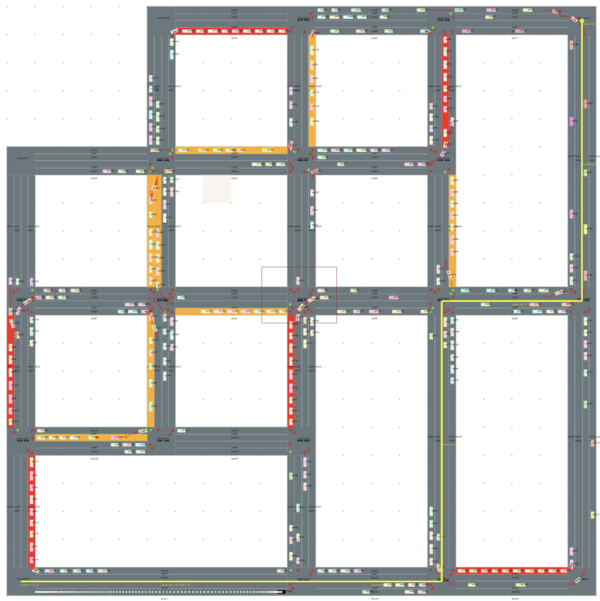

# Traffic simulator

This is a fork of [RoadTrafficSimulator](https://github.com/volkhin/RoadTrafficSimulator)

The main purpose of this project is to simulate traffic on a map and to find the best path for a car to reach its
destination.

  
<b>Simulator Preview</b>

    

[//]: # (
)

[//]: # (  
<b>Traffic Highlights</b>
)

[//]: # (
)

[//]: # (
)

[//]: # (    )

[//]: # (
)

  
<b>Best Path Finder</b>

    

## Online Demo
[Simulator](https://tede12.github.io/traffic-simulator/index.html)

## Commands

- shift + click - add new intersection
- shift + drag - add new road
- ctrl + click (on lanes) - add new car (if track path exists the car will follow it)
- alt (or option) + click (on intersections) - add new point to track path
- alt (or option) + click (everywhere except intersections) - remove last point from track path
- alt (or option) + 's' - save and draw track path (if it exists, else remove it)
- alt (or option) + 'c' - send path to pathFinder, draw path and start car (needs pathFinder server running)
    - repeating the command in different period of time, you will get the best path in the current situation
- alt (or option) + 'g' - ask the shortest path based only on road length to api and draw path (needs pathFinder server
  running)

## How to run

1. Install all dependencies  
   `npm install`

2. Run 2 scripts in parallel  
   `npm run cstart`  
   `npm run start`

For running the pathFinder server (backend), you need to have installed [ITAS-API](https://github.com/sir3mat/ITAS-API)

## How to build

`npm run gh-pages` for building the project and publishing it on github pages  
 
For building the **CoffeeScript** backend just run `npm run cbuild` (or `gulp build`)  
For building the **ReactJS** frontend just run `npm run build`
